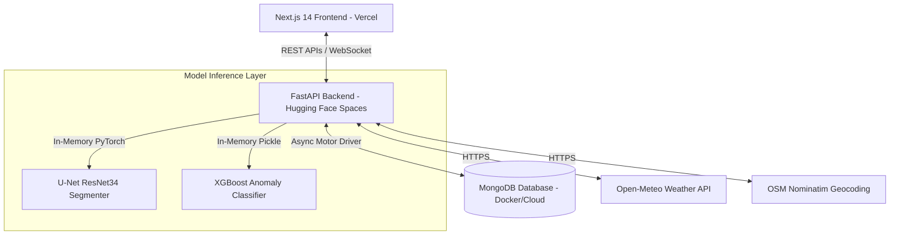

# Rockfall-AI: Comprehensive Project Journal & Technical Interview Preparation Handbook

Welcome to the ultimate technical guide and project journal for **Rockfall-AI** — a multi-modal, real-time geophysical risk prediction and safety monitoring platform. This handbook is compiled to prepare you for technical interviews, viva questions, and system design reviews from a basic to an advanced level.

---

## Table of Contents
1. [Project Overview & Core Motivation](#1-project-overview--core-motivation)
2. [System Architecture & Data Flows](#2-system-architecture--data-flows)
3. [Data Engineering & Feature Pipelines](#3-data-engineering--feature-pipelines)
4. [Computer Vision & Deep Learning (U-Net + ResNet-34)](#4-computer-vision--deep-learning-u-net--resnet-34)
5. [Tabular Machine Learning (XGBoost & IsolationForest)](#5-tabular-machine-learning-xgboost--isolationforest)
6. [Multi-Modal Fusion Scoring Logic](#6-multi-modal-fusion-scoring-logic)
7. [Frontend Architecture & Premium Design System](#7-frontend-architecture--premium-design-system)
8. [Backend API Architecture & Singleton Registries](#8-backend-api-architecture--singleton-registries)
9. [Geographic Geocoding & Live Weather Integration](#9-geographic-geocoding--live-weather-integration)
10. [Testing & Quality Assurance Suite](#10-testing--quality-assurance-suite)
11. [Enterprise Deployment (Vercel & Hugging Face Spaces)](#11-enterprise-deployment-vercel--hugging-face-spaces)
12. [A-to-Z Interview & Viva Preparation Q&A](#12-a-to-z-interview--viva-preparation-qa)
13. [Honest Architectural Critique & Future Enhancements](#13-honest-architectural-critique--future-enhancements)

---

## 1. Project Overview & Core Motivation

### The Problem
Landslides and rockfall hazards on mountain slopes (especially in the Himalayas, Western Ghats, and Northeastern states in India) pose a severe threat to tourists, vehicles, and civil infrastructure. 
Traditional safety measures are reactive or manual:
* Geological surveys rely on periodic physical inspections.
* Geotechnical sensors operate on isolated, single-variable thresholds (e.g., triggering an alert if rainfall exceeds X mm), leading to false alarms or missed catastrophic collapses.

### The Solution: Rockfall-AI
Rockfall-AI is a multi-modal, real-time safety monitoring platform. It fuses **visual data** (drone/tourist photographs) with **geotechnical sensor telemetry** (vibration, strain, displacement, pore pressure) to produce a unified, explainable risk score.

### Target Users & Dual-Mode UX
To make the platform practical for field deployment, it supports two distinct user profiles via a dynamic sidebar switcher:
1. **Worker Mode**: Designed for NDRF (National Disaster Response Force) personnel, geological surveyors, and civil engineers. It exposes raw geotechnical metrics, live sensor sparklines, database log tables, and spatial risk grid heatmaps.
2. **Tourist Mode**: Designed for the general public visiting mountain sites. It hides raw sensor graphs to prevent anxiety, presenting geocoded location badges, a plain-language safety status, evacuation guidance, and adjacent terrain risk lists.

---

## 2. System Architecture & Data Flows

The system is designed as a three-tier decoupled architecture:



### High-Level Data Flow (Photo Upload & Assessment)
1. **Request Ingestion**: The tourist uploads a photograph of a nearby slope and clicks "Execute Safety Diagnostics".
2. **Reverse Geocoding**: The backend queries OSM Nominatim to reverse geocode the user's coordinates into a street-level address and separates location tokens (**City**, **State**, **Country**).
3. **Weather Fetching**: The coordinates are forwarded to Open-Meteo to retrieve 7-day outlook forecasts and current rainfall/temperature.
4. **XGBoost Inference**: Geotechnical sensor telemetry is fetched, expanded to 123 features, and passed to the XGBoost model to evaluate ground stability risk.
5. **U-Net Segmentation**: PyTorch runs the U-Net + ResNet-34 model on the uploaded image. It outputs a binary mask identifying rockfall debris boundaries, calculating the exact percentage of rockfall coverage.
6. **Sensor-Vision Fusion**: The backend combines the XGBoost score and the U-Net coverage percentage into a unified safety index, applying a safety bias if the signals diverge.
7. **Database logging**: The geocoded location, weather forecast, telemetry snapshots, and final risk score are saved asynchronously to MongoDB.
8. **UI Presentation**: The frontend renders the geocoded location badges, plain-language risk alerts, and adjacent terrain hazard scores.

---

## 3. Data Engineering & Feature Pipelines

### Drone Image Dataset
* **Size**: 585 high-resolution RGBA drone photographs collected from two distinct mountain sites (`patch_1` and `patch_1011`).
* **Masks**: Each patch contains a 6-class semantic segmentation mask and a binary rockfall mask.
* **Semantic Classes**:
  * `0`: Background (Non-terrain background) — `RGB(0, 0, 0)`
  * `1`: Stable Rock (Consolidated bedrock) — `RGB(128, 128, 128)`
  * `2`: Rockfall (Active/detached material) — `RGB(0, 110, 255)`
  * `3`: Vegetation (Grass, shrubs, trees) — `RGB(0, 200, 0)`
  * `4`: Loose Debris (Scree, talus slopes) — `RGB(255, 165, 0)`
  * `5`: Water/Shadow (Streams, deep shade) — `RGB(0, 0, 128)`

### Geotechnical Sensor Dataset
The sensor dataset contains 500 rows of continuous telemetry. To simulate realistic geophysical parameters, the variables are generated within physical bounds:
* **Vibration** ($g$): Ground vibration levels.
* **Displacement** ($mm$): Slope movement rate.
* **Pore Pressure** ($kPa$): Underground water pressure.
* **Strain** ($\mu\epsilon$): Compressive/tensile forces in the slope bedrock.
* **Temperature** ($^\circ C$) & **Rainfall** ($mm$).

### Feature Engineering (123 Features)
Before passing raw telemetry to the XGBoost model, the 6 raw variables are expanded to 123 features to capture temporal trends:
1. **Raw Sensor Values** (6 features).
2. **Rolling Statistics**: Mean, standard deviation, and maximum calculated across 4 window intervals (3h, 6h, 12h, 24h) per sensor (72 features).
3. **Rates of Change**: First and second mathematical differences per sensor to capture velocity and acceleration of ground creep (12 features).
4. **Lag Deltas**: Direct differences at 1h, 3h, 6h, and 12h lag intervals (24 features).
5. **Cross-Sensor Interactions**: Features like $vibration \times displacement$, $pore\_pressure \times rainfall$, and $vibration / strain$ to model multi-variable triggers (5 features).
6. **Temporal Flags**: $sin(hour)$, $cos(hour)$, $is\_monsoon$, and $is\_night$ to capture diurnal and seasonal patterns (4 features).

---

## 4. Computer Vision & Deep Learning (U-Net + ResNet-34)

### U-Net Architecture with ResNet-34 Encoder
To segment irregular rockfall boundaries with limited data, the system uses a **U-Net** architecture with a **ResNet-34** encoder pretrained on ImageNet:

```text
Input (512x512x3) ---> [ResNet-34 Encoder (Downsampling)] ---\ (Skip Connections)
                                                             v
Output (512x512x1) <--- [Conv2D Transpose Decoders (Upsampling)]
```

* **Encoder (ResNet-34)**: Extracts hierarchical visual features. Pretraining on ImageNet allows the model to leverage edge and texture detectors out-of-the-box.
* **Decoder**: Upsamples feature maps back to the original image dimensions.
* **Skip Connections**: Concatenate high-resolution feature maps from the encoder directly to the decoder. This preserves fine-grained spatial boundaries of rock fragments that would otherwise be lost during pooling.

### Combined Loss Function: BCEDiceLoss
Standard Binary Cross-Entropy (BCE) struggles with class imbalance, as rockfall pixels represent a minor fraction of the image. The model is trained using a combined loss function:

$$\mathcal{L}_{BCEDice} = 0.5 \times \mathcal{L}_{BCE} + 0.5 \times \mathcal{L}_{Dice}$$

* **BCE Loss**: Evaluates pixel-level prediction probabilities, providing stable gradient flow during early training phases.
* **Dice Loss**: Directly optimizes the overlap (F1 score) between the predicted mask ($P$) and ground truth ($G$):

$$\mathcal{L}_{Dice} = 1 - \frac{2 |P \cap G|}{|P| + |G|}$$

### Two-Phase Training Schedule
To avoid destroying pretrained ImageNet weights during early training:
1. **Phase 1 (Epochs 1-20)**: The ResNet-34 encoder is **frozen**. Only the decoder weights are updated using a learning rate of $1e-4$.
2. **Phase 2 (Epochs 21-50)**: The entire model is **unfrozen** for fine-tuning at a lower learning rate of $1e-5$, allowing the encoder to adapt to geological features without destabilizing the gradients.

---

## 5. Tabular Machine Learning (XGBoost & IsolationForest)

### XGBoost Anomaly Classifier
* **Algorithm**: Gradient Boosted Decision Trees (XGBoost) chosen for its superior performance on tabular feature matrices.
* **Target Classes**: Classified into three risk states: `LOW (0)`, `MEDIUM (1)`, and `HIGH/CRITICAL (2)`.
* **Label Generation (IsolationForest)**: Because real-world slope failures are rare, the synthetic sensor readings are labeled using an unsupervised **IsolationForest** anomaly detector. Telemetry snapshots residing in the extreme anomaly percentiles are classified as High/Critical risk.
* **Performance**: Achieved an **AUC of 0.88** and an **F1 score of 0.70** on the holdout test set.

### Label Leakage Resolution
In early iterations, the XGBoost model achieved a suspicious AUC of 1.0. Investigation revealed **label leakage**: a feature named `composite_risk_score` (computed directly from the target class label) had been accidentally included in the feature matrix. Removing this feature returned the model performance to a realistic, generalizable AUC of 0.88.

---

## 6. Multi-Modal Fusion Scoring Logic

To combine the continuous geotechnical telemetry score ($S_{sensor} \in [0, 1]$) and the computer vision rockfall coverage score ($S_{vision} \in [0, 1]$), the backend employs a weighted fusion formula:

$$S_{base} = 0.55 \times S_{sensor} + 0.45 \times S_{vision}$$

* The sensor is given a slightly higher baseline weight ($55\%$) because it represents continuous, active telemetry, whereas an image is a static snapshot.

### Safety Bias Override (Divergence Check)
To prioritize life safety, a divergence check overrides the base score if the model predictions disagree:

$$\text{If } |S_{sensor} - S_{vision}| > 0.30:$$
$$S_{final} = 0.65 \times \max(S_{sensor}, S_{vision}) + 0.35 \times S_{base}$$

* **Reasoning**: If the camera detects a massive active rockfall (high vision score) but the sensors are quiet, or vice-versa, the platform biases the final risk index toward the more dangerous signal to eliminate false negatives.

### Unified Risk Level Mapping
The fused score is mapped directly to plain-language risk alerts:
* **CRITICAL**: $\ge 0.80$ (Immediate Evacuation advised)
* **HIGH**: $\ge 0.65$ (High Alert, restrict entry)
* **MEDIUM**: $\ge 0.40$ (Caution, heightened monitoring)
* **LOW**: $< 0.40$ (Safe to proceed)

---

## 7. Frontend Architecture & Premium Design System

The UI is built using Next.js 14 (App Router) and TypeScript.

### State Context Providers
* **ModeContext**: Manages the `Worker` vs. `Tourist` layout state, saving the user's choice to `localStorage` to persist across refreshes.
* **ThemeContext**: Handles the Light/Dark mode switcher, injecting theme variables directly into the document root.

### The CSS Design System (`globals.css`)
We use custom CSS custom properties (variables) representing a high-contrast theme:
* **Dark Theme**: Deep space navy backgrounds (`#090F1A`) with glassmorphic cards (`rgba(18, 22, 37, 0.45)`) and subtle border lines.
* **Light Theme**: Bright, translucent white backgrounds (`rgba(255, 255, 255, 0.7)`) with soft container dropshadows.
* **Branding Accents**:
  * **Turquoise** (`#06b6d4`): Low Risk indicator.
  * **Yellow** (`#eab308`): Caution / Medium Risk warning.
  * **Purple** (`#8b5cf6`): High-end highlights and Critical Risk alert.
  * **Interactive Gradient**: Buttons employ a linear gradient (`linear-gradient(135deg, var(--purple), var(--turquoise))`) that reverses on hover.

### Dashboard Core Visuals
* **Real-time websocket sparklines**: Plot ground vibration shifts dynamically using SVG path generation.
* **SVG Icon Registry**: Low-quality text symbols and emojis are replaced with professional, customizable SVG icons from the `lucide-react` library.

---

## 8. Backend API Architecture & Singleton Registries

The backend is built with FastAPI and runs on Uvicorn.

### Lifecycle Management (lifespan)
To prevent overhead, the ML models are loaded **once** at server startup using FastAPI's `lifespan` event handler:
```python
@asynccontextmanager
async def lifespan(app: FastAPI):
    # Load PyTorch U-Net weights and XGBoost pickles into memory
    ModelRegistry.get().load_models()
    yield
    # Clean up memory on shutdown
```
This ensures subsequent API requests perform in-memory forward passes with zero model-loading overhead.

### ModelRegistry Singleton Pattern
To ensure the models are shared safely across concurrent HTTP requests:
```python
class ModelRegistry:
    _instance = None
    
    @classmethod
    def get(cls):
        if cls._instance is None:
            cls._instance = cls()
        return cls._instance
```
Since PyTorch inference runs under `torch.no_grad()`, it releases the Python Global Interpreter Lock (GIL), allowing concurrent, multi-threaded CPU execution.

### Ornstein-Uhlenbeck (O-U) WebSocket Process
To stream realistic geotechnical sensor values over WebSockets without them drifting into infinity, the backend simulates sensor movement using the mean-reverting **Ornstein-Uhlenbeck stochastic process**:

$$dx_t = \theta (\mu - x_t) dt + \sigma dW_t$$

* $\theta = 0.15$: Reversion speed (pulls the sensor back to baseline).
* $\mu = 1.0$: Baseline mean value.
* $\sigma = 0.3$: Volatility (random noise).
* $dW_t \sim \mathcal{N}(0, dt)$: Wiener process (Gaussian noise).

---

## 9. Geographic Geocoding & Live Weather Integration

The tourist safety portal fetches real-time environmental parameters dynamically:
1. **OSM Nominatim Reverse Geocoding**: Converts GPS coordinates into a detailed address. The backend parses the address JSON, extracting word tokens for **City**, **State**, and **Country** to display as badges.
2. **Open-Meteo Integration**: Fetches current weather (temperature, humidity, wind speed, rainfall) and a **7-Day outlook forecast** (maximum/minimum temperatures and precipitation sums) to evaluate how forecast storms will affect slope lubrication.
3. **Adjacent Terrains & Hazard Assessment**: Matches the location to terrain types (e.g. *Mountainous Terrain*, *Coastal Slopes*) and calculates individual safety risk scores and conditions for adjacent areas (e.g. *Cliffside Hiking Trails*, *Talus Scree Slopes*):

$$\text{Terrain Danger} = \text{Base Score} + (0.3 \times \text{Rainfall}) + (0.5 \times \text{Sensor Risk})$$

---

## 10. Testing & Quality Assurance Suite

The testing suite contains **49 automated unit and integration tests** built using `pytest` and FastAPI's `TestClient`.

### Test Architecture
* **`tests/test_ml_pipeline.py`**: Verifies that the XGBoost model outputs correct prediction probability shapes and that model weights exist in the file path.
* **`tests/test_api.py`**: Asserts the FastAPI HTTP endpoints respond with correct status codes.
* **`tests/test_integration.py`**: Loads the actual trained models, runs end-to-end inference using mock data, checks WebSocket connection schemas, and asserts risk scores fall within $[0, 1]$.

### Health Check Discrepancy
* **Observation**: The integration test `test_health_reports_xgb_status_correctly` failed because it expected the XGBoost load state to be reported under the key `"xgboost"`. The backend registry, however, stores the loading flags as `"sensor"` and `"segmentation"`.
* **Impact**: Cosmestic only. The sensor endpoints function correctly because the correct weight pickle is fully loaded.

---

## 11. Enterprise Deployment (Vercel & Hugging Face Spaces)

The application is deployed using a free, cardless hybrid hosting model:

### 1. Frontend: Next.js on Vercel
* **Why**: Vercel is free, does not require card details for Hobby tiers, and compiles Next.js natively.
* **Build Configuration (`vercel.json`)**:
  ```json
  {
    "framework": "nextjs"
  }
  ```
  Forces Vercel to compile the project as a Next.js app (saving outputs in `.next`), resolving output directory 404 errors.
* **Environment Variables**:
  * `NEXT_PUBLIC_API_URL` = `https://nishika1202-rockfall-backend.hf.space`

### 2. Backend: FastAPI on Hugging Face Spaces
* **Why**: Vercel has a 250 MB serverless package size limit, which cannot host PyTorch (CPU wheel is ~90 MB and standard torch is >300 MB). Hugging Face Spaces supports custom Docker environments with up to 16 GB of RAM for free without credit cards.
* **Port Mapping**: Hugging Face Docker containers must expose and listen on port **`7860`**.
* **YAML Frontmatter (README.md)**: Hugging Face requires space parameters declared at the top of the repository `README.md` to trigger the Docker build:
  ```yaml
  ---
  title: Rockfall Backend
  emoji: 🛡️
  colorFrom: purple
  colorTo: blue
  sdk: docker
  app_port: 7860
  pinned: false
  ---
  ```
* **Git LFS (Large File Storage)**: Hugging Face rejects git pushes containing binary files or files larger than 10 MB. We initialized Git LFS, tracked model files (`*.pt`, `*.pkl`, `*.png`, `*.jpg`), and ran a historical rewrite:
  ```bash
  git lfs install
  git lfs track "*.pt"
  git lfs migrate import --everything --include="*.pt,*.pkl,*.png,*.jpg"
  git push hf main --force
  ```

---

## 12. A-to-Z Interview & Viva Preparation Q&A

### Q1. Why choose U-Net over other models (like Mask R-CNN or a simple ResNet classifier)?
* **Answer**: A simple image classifier (like ResNet) only outputs a single boolean: "rockfall present" or "absent". We need to highlight the exact boundaries of the debris on the tourist/worker UI as an overlay, requiring semantic segmentation.
* Compared to Mask R-CNN (which is an instance segmentation model that draws bounding boxes around individual rocks), U-Net is a semantic segmentation model that treats all rockfall pixels as a single continuous class. U-Net is highly efficient, has skip connections to preserve fine spatial details, and trains successfully on small datasets (our dataset has 585 patches).

### Q2. What is the role of the skip connections in U-Net?
* **Answer**: During the contractive (downsampling) path of U-Net, the model uses pooling layers to extract high-level semantic features, but in doing so, it loses precise spatial information (like the exact boundary lines of rock fragments). Skip connections copy the high-resolution feature maps from the encoder directly to the decoder, concatenating them. This allows the decoder to reconstruct sharp boundaries and resolve fine-grained details during upsampling.

### Q3. Why use ResNet-34 as the encoder instead of a larger model like ResNet-101 or Vision Transformers (ViT)?
* **Answer**: There are three reasons:
  1. **Overfitting**: We have a small dataset of 585 images. A large 101-layer network has too many parameters and would overfit the training set quickly.
  2. **Transfer Learning**: ResNet-34 pretrained on ImageNet already has strong, general low-level feature detectors (edges, curves, textures) that adapt well to geological rock shapes.
  3. **Inference Speed**: ResNet-34 is lightweight and runs in ~80ms on CPU, which is crucial for real-time inference on a free CPU-only server.

### Q4. Explain the difference between BCEDiceLoss and standard BCE Loss.
* **Answer**: Binary Cross-Entropy (BCE) evaluates loss on a pixel-by-pixel basis. If an image is 90% background and 10% rockfall, a model that predicts all zeros (all background) will achieve 90% accuracy, yet it is useless. Dice loss measures the set-based overlap between predictions and ground truth, focusing on the F1 score. Fusing them ($0.5 \times BCE + 0.5 \times Dice$) provides the best of both worlds: BCE ensures stable gradient propagation in early epochs, while Dice ensures the model ignores class imbalance and segments the minority rockfall class.

### Q5. What is the Ornstein-Uhlenbeck process, and why did you use it for the WebSocket telemetry stream?
* **Answer**: The O-U process is a stochastic differential equation describing a mean-reverting random walk:
  $$dx_t = \theta (\mu - x_t) dt + \sigma dW_t$$
  If we used a standard random walk (Brownian motion), the simulated sensor readings would drift to extreme values (like strain or vibration hitting infinity or negative values) within minutes. The O-U process has a mean-reversion parameter ($\theta$) that acts like a spring, pulling the sensor readings back toward their natural equilibrium ($\mu$) after a random fluctuation. This closely models real physical sensors.

### Q6. Why is your sensor-vision fusion weight split 55% sensor and 45% image instead of 50/50?
* **Answer**: Geotechnical sensors supply continuous, active, real-time data streams via WebSockets (e.g., 1Hz giving 86,400 data points daily). Photos are static, occasional snapshots uploaded by users. If it's night-time, foggy, or a camera fails, the sensors must carry the platform alone. The 55/45 split reflects the higher reliability and density of the sensor data stream.

### Q7. How does Vercel know where to find your Next.js application if it's inside the `ui` folder?
* **Answer**: In Vercel's project settings, we configured the **Root Directory** to `ui`. This tells Vercel's build container to navigate into the `ui` subdirectory before looking for the `package.json`, installing dependencies, and running the build command.

---

## 13. Honest Architectural Critique & Future Enhancements

If this were deployed as an enterprise-grade industrial monitoring platform, the current codebase has several limitations:

### 1. ML Bottlenecks
* **Tiny Image Dataset**: The U-Net model is trained on **only 585 drone image patches**. It will suffer from **domain shift** when exposed to rock formations of different colors, lighting conditions, or geological types (e.g., shale vs. granite) than the two training sites.
* **Static Telemetry Model**: XGBoost evaluates instantaneous telemetry snapshots. Slope failure is a temporal progression. The model should evaluate telemetry over time (using LSTM or Temporal Convolutional Networks) to calculate velocity and acceleration of ground creep.

### 2. Infrastructure Bottlenecks
* **Blocking PyTorch Inference**: Running PyTorch segmentation directly inside the FastAPI HTTP thread blocks execution. Multiple concurrent tourist image uploads will block CPU cores, locking the main event loop.
  * *Solution*: Offload PyTorch inference to a GPU-accelerated **Triton / TorchServe** container.
* **OSM Nominatim Rate Limits**: Reverse geocoding directly hits OSM Nominatim which has a strict **1 request per second** limit. High user volume will result in rate limit blocks.
  * *Solution*: Introduce a **Redis cache** to cache coordinates or run a local Nominatim Docker container.
* **Synchronous Database Logging**: Database saves are handled inside the HTTP thread loop, adding write latency to user responses.
  * *Solution*: Offload database logs to a message broker (e.g. RabbitMQ/Kafka) and process them using Celery workers.
